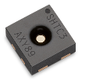
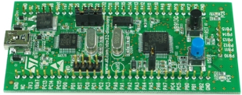
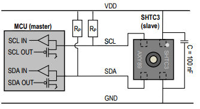

# SHTC3 Sample Code for STM32

This uVision sample project shows the basic usage of Sensirion's SHTC3
temperature and humidity sensor.

## Compatibility

The code herein is compatible with Sensirion's SHTC3 digital temperature and
humidity sensor.

* Sensirion SHTC3 Sensor
* STM32 Discovery board ([STM32VLDISCOVERY])
* uVision (5.25)

## System Requirements

 * Windows PC
 * SHTC3 Sensor
 * STM32-Discovery board from STMicroelectronics ([STM32VLDISCOVERY])
 * USB type A to mini-B cable

## Getting Started

 1. Download the latest version of Microcontroller Development Kit for ARM
    (MDK-ARM). The software can be used without a product license for a maximum
    code size of 32 Kbytes.
    *Tested Version: 5.25*
 2. Run the Installer and follow the instructions. (MDK525.EXE)
 3. Open the project file `shtc3-stm32.uvprojx`.
 4. Press F7 or click  to build
    the target.
 5. Connect the SHTC3 Sensor to the STM32-Discovery board:

    |Discovery board|SHTC3-Sensor|
    |---------------|------------|
    | 3V3           | VDD        |
    | BP8           | SCL        |
    | BP9           | SDA        |
    | GND           | GND        |
    Also connect pull-up resistors (e.g. 10kOhm) from SCL and SDA to VDD and
    add a decoupling capacitor between VDD and GND.

    

 6. Connect the STM32-Discovery board to the PC with the USB cable.
 7. Start the debugger by pressing Ctrl+F5 or click Debug in the menu →
    Start/Stop Debug Session .
 8. Press F5 or click  to run the
    program.
    The green LED lights if no error occurs, in this case the communication
    with the sensor works. The blue LED lights up when a relative humidity of
    more than 50% is measured. You can simulate this by breathing on the
    sensor.
 9. Add the variables error, id, temperature, and humidity to the watcher or
    set a breakpoint to check the values.

## Further Information

Sensirion's developer page
[developer.sensirion.com](https://developer.sensirion.com) provides more
developer resources for different platforms and products.
Also the [SHTC3 product page](https://www.sensirion.com/shtc3/) has more
detailed information about the sensor.

[STM32VLDISCOVERY]: https://www.st.com/en/evaluation-tools/stm32vldiscovery.html
